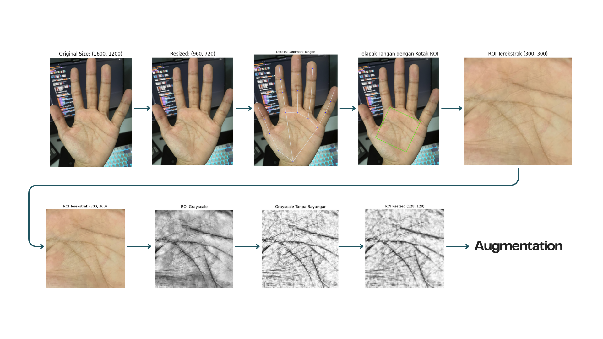

# Palm Recognition System 🖐️

A biometric recognition system based on palm prints using ROI box extraction with MediaPipe. The system is integrated with Siamese Neural Network architecture for palm embedding and recognition.

## 📑 Table of Contents

- [Main Features](#-main-features)
- [Preprocessing Visualization](#-preprocessing-visualization)
- [Preprocessing Steps](#-preprocessing-steps)
- [Model Architecture](#-model-architecture)
- [Model Results](#-model-results)
- [Installation Guide](#-installation-guide)
- [Limitations](#-limitations)
- [Best Practices](#-best-practices)
- [Future Development](#-future-development)

## 🚀 Main Features

- Automatic hand landmark detection using MediaPipe
- Dynamic ROI (Region of Interest) extraction with auto-rotate
- Automatic quality check for brightness and sharpness
- Comprehensive preprocessing with step-by-step visualization
- Automatic data augmentation for dataset enhancement
- Palm recognition using Siamese Neural Network
- Embedding database system for storage and matching
- Process visualization for debugging and analysis

## 📊 Preprocessing Visualization

### 1. Landmark Detection and ROI Extraction

### 2. Quality Check

### 3. Image Enhancement

### 4. Data Augmentation



## 🔄 Preprocessing Steps

1. **Initial Input and Validation**

   - Resize image to standard size (1280x720)
   - Input image quality validation

2. **Detection and Extraction**

   - Hand landmark detection using MediaPipe
   - Palm ROI extraction using dynamic box
   - Auto-rotate for orientation standardization

3. **Quality Check**

   - Brightness evaluation (threshold: 100-180)
   - Sharpness analysis (minimum threshold: 8)
   - Quality metrics visualization

4. **Image Enhancement**

   - Grayscale conversion
   - Shadow removal using morphological techniques
   - Contrast normalization with CLAHE
   - Gamma correction

5. **Standardization**
   - Resize to 128x128
   - Pixel value normalization

## 🏗️ Model Architecture

- **Base Network:**
  ```
  Input (128x128x1)
  ↓
  Conv2D(64, 10x10) + ReLU
  MaxPooling2D
  ↓
  Conv2D(128, 7x7) + ReLU
  MaxPooling2D
  ↓
  Conv2D(128, 4x4) + ReLU
  MaxPooling2D
  ↓
  Conv2D(256, 4x4) + ReLU
  ↓
  Flatten
  Dense(4096, sigmoid)
  ```

## 📈 Model Results

### 1. Embedding Visualization

```
[Image 5: Embedding Space]
- t-SNE visualization of palm embeddings
- Identity-based clustering
```

### 2. Recognition Results

```
[Image 6: Recognition Examples]
Case 1: Match Found
- Query Image
- Best Match
- Similarity Score: 0.92

Case 2: No Match
- Query Image
- Closest Match
- Similarity Score: 0.45 (Below Threshold)
```

### 3. Model Metrics

- Accuracy: XX%
- Precision: XX%
- Recall: XX%
- F1-Score: XX%

## ⚙️ Installation Guide

1. Clone repository:

```bash
git clone https://github.com/DimPalm-Capstone-Project/ML_Structuring_Model.git
cd ML_Structuring_Model
```

2. Install dependencies:

```bash
pip install -r requirements.txt
```

Requirements:

```
opencv-python>=4.8.0
mediapipe>=0.10.0
numpy>=1.24.0
tensorflow>=2.12.0
matplotlib>=3.7.0
```

## ⚠️ Limitations

1. **Lighting**

   - Requires adequate lighting (brightness: 100-180)
   - Sensitive to excessive shadows

2. **Hand Position**

   - Palm must be fully open
   - Capture angle must be relatively perpendicular

3. **Hardware**
   - Requires camera with minimum 720p resolution
   - Preprocessing requires adequate CPU/RAM resources

## 💡 Best Practices

1. **Image Capture**

   - Use even lighting
   - Position hand perpendicular to camera
   - Ensure palm is fully open
   - Avoid complex backgrounds

2. **Preprocessing**

   - Always check quality visualization
   - Use data augmentation for dataset variation
   - Save intermediate results for debugging

3. **Deployment**
   - Implement embedding caching system
   - Use batch processing for optimization
   - Monitor resource usage regularly

## 🔮 Future Development

1. **Accuracy Improvement**

   - Implement multi-scale feature extraction
   - Integrate attention techniques
   - Develop more advanced data augmentation

2. **Optimization**

   - Implement model quantization
   - Develop lite version for mobile
   - Optimize preprocessing pipeline

3. **Additional Features**

   - Integration with anti-spoofing system
   - Development of real-time visualization GUI
   - Implementation of multi-modal recognition

4. **Security**
   - Development of embedding database encryption
   - Implementation of secure API endpoints
   - Development of audit trail system
