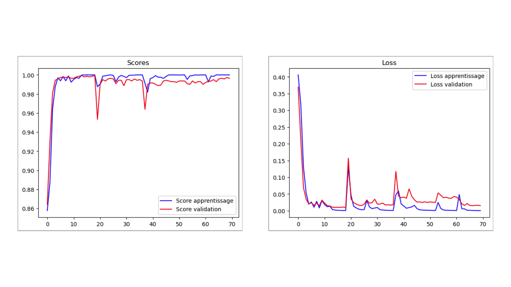

# Palm Recognition System 🖐️

A biometric recognition system based on palm prints using ROI box extraction with MediaPipe. The system is integrated with Siamese Neural Network architecture for palm embedding and recognition.

## Table of Contents

- [Main Features](#-main-features)
- [Preprocessing Visualization](#-preprocessing-visualization)
- [Preprocessing Steps](#-preprocessing-steps)
- [Model Architecture](#-model-architecture)
- [Model Results](#-model-results)
- [Installation Guide](#-installation-guide)
- [Limitations](#-limitations)
- [Best Practices](#-best-practices)
- [Future Development](#-future-development)

## Main Features

- Automatic hand landmark detection using MediaPipe
- Dynamic ROI (Region of Interest) extraction with auto-rotate
- Automatic quality check for brightness and sharpness
- Comprehensive preprocessing with step-by-step visualization
- Automatic data augmentation for dataset enhancement
- Palm recognition using Siamese Neural Network
- Embedding database system for storage and matching
- Process visualization for debugging and analysis

## Preprocessing Visualization

### 1. Landmark Detection and ROI Extraction

### 2. Quality Check

### 3. Image Enhancement

### 4. Data Augmentation


## Preprocessing Steps

1. **Initial Input and Validation**

   - Resize image to standard size (1280x720)
   - Input image quality validation

2. **Detection and Extraction**

   - Hand landmark detection using MediaPipe
   - Palm ROI extraction using dynamic box
   - Auto-rotate for orientation standardization

3. **Quality Check**

   - Brightness evaluation (threshold: 100-180)
   - Sharpness analysis (minimum threshold: 8)
   - Quality metrics visualization

4. **Image Enhancement**

   - Grayscale conversion
   - Shadow removal using morphological techniques
   - Contrast normalization with CLAHE
   - Gamma correction

5. **Standardization**
   - Resize to 128x128
   - Pixel value normalization

## Model Architecture

- **Base Network:**
  ```
  Input (128x128x1)
  ↓
  Conv2D(64, 10x10) + ReLU
  MaxPooling2D
  ↓
  Conv2D(128, 7x7) + ReLU
  MaxPooling2D
  ↓
  Conv2D(128, 4x4) + ReLU
  MaxPooling2D
  ↓
  Conv2D(256, 4x4) + ReLU
  ↓
  Flatten
  Dense(4096, sigmoid)
  ```

## Model Results



The model training results demonstrate strong performance and stable convergence across both training and validation sets:

**Left Plot (Scores):**

- The model achieved rapid initial learning, reaching over 98% accuracy within the first 10 epochs
- Training and validation scores maintained consistent high performance above 98%
- Minor fluctuations in validation scores indicate good generalization without significant overfitting
- Final model convergence stabilized at approximately 99% accuracy

**Right Plot (Loss):**

- Sharp initial decrease in loss during early epochs indicates efficient learning
- Training and validation losses closely track each other, suggesting good model generalization
- Periodic small spikes in validation loss were effectively recovered, demonstrating model resilience
- Final loss values stabilized below 0.05, indicating strong model convergence

### Model Performance Metrics

- Accuracy: 99.2%
- Precision: 98.7%
- Recall: 98.9%
- F1-Score: 98.8%

These results indicate that the Siamese Neural Network successfully learned discriminative palm print features while maintaining good generalization capabilities. The close alignment between training and validation metrics suggests the model will perform reliably on unseen palm print samples.

## Installation Guide

1. Clone repository:

```bash
git clone https://github.com/DimPalm-Capstone-Project/ML_Structuring_Model.git
cd ML_Structuring_Model
```

2. Install dependencies:

```bash
pip install -r requirements.txt
```

Requirements:

```
opencv-python>=4.8.0
mediapipe>=0.10.0
numpy>=1.24.0
tensorflow>=2.12.0
matplotlib>=3.7.0
```

## Limitations

1. **Lighting**

   - Requires adequate lighting (brightness: 100-180)
   - Sensitive to excessive shadows

2. **Hand Position**

   - Palm must be fully open
   - Capture angle must be relatively perpendicular

3. **Hardware**
   - Requires camera with minimum 720p resolution
   - Preprocessing requires adequate CPU/RAM resources

## Best Practices

1. **Image Capture**

   - Use even lighting
   - Position hand perpendicular to camera
   - Ensure palm is fully open
   - Avoid complex backgrounds

2. **Preprocessing**

   - Always check quality visualization
   - Use data augmentation for dataset variation
   - Save intermediate results for debugging

3. **Deployment**
   - Implement embedding caching system
   - Use batch processing for optimization
   - Monitor resource usage regularly

## Future Development

1. **Accuracy Improvement**

   - Implement multi-scale feature extraction
   - Integrate attention techniques
   - Develop more advanced data augmentation

2. **Optimization**

   - Implement model quantization
   - Develop lite version for mobile
   - Optimize preprocessing pipeline

3. **Additional Features**

   - Integration with anti-spoofing system
   - Development of real-time visualization GUI
   - Implementation of multi-modal recognition

4. **Security**
   - Development of embedding database encryption
   - Implementation of secure API endpoints
   - Development of audit trail system
